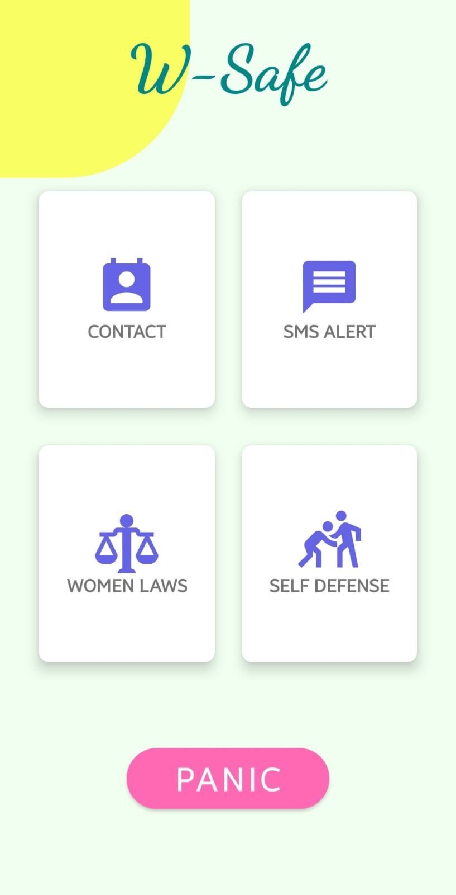
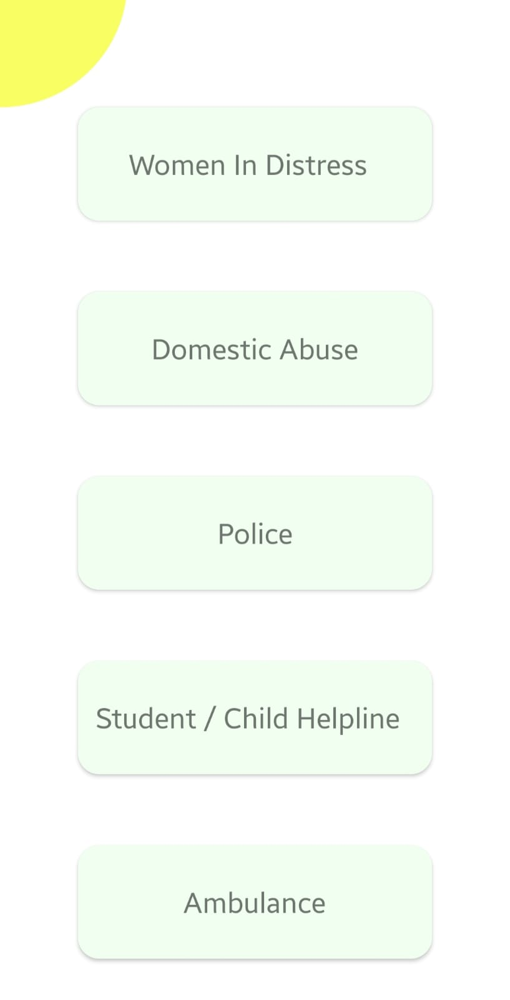
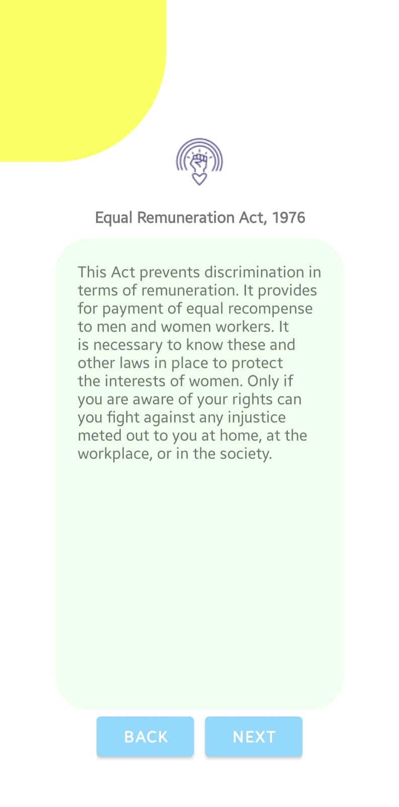
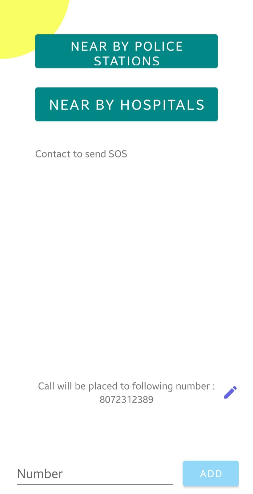
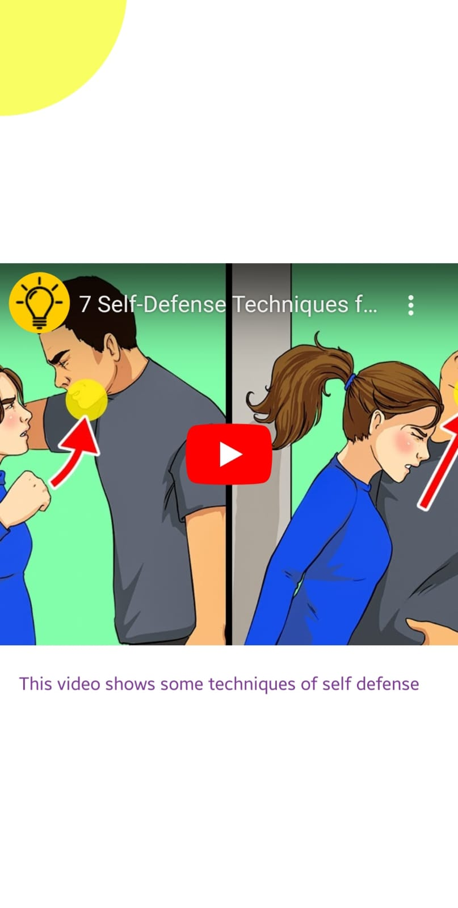

# ⚡ W Safe - A Women Safety Application
## _Feel Safe Everywhere_

W-Safe is a comprehensive women safety application designed to empower and protect women in times of distress. This Android application combines advanced features to provide a reliable safety solution. With W-Safe, women can feel more confident and secure, knowing that help is just a tap away. It is built using Java in Android Studio.

## Key Features

- **Voice Command SOS Activation**:Trigger emergency actions using predefined voice commands, such as sending SOS alerts and activating the siren.
- **GPS Tracking**: Retrieve the user’s last known location and share it with registered contacts for quick assistance.
- **SOS Messaging**: Send distress messages to multiple registered contacts, notifying them of the user’s situation and location.
- **Siren Sound**: Attract attention and deter potential threats by activating a loud siren sound.
- **Find Nearby Police Stations and Hospitals**: Quickly locate the nearest police stations and hospitals in case of emergencies.
- **Women Safety Laws**: Access information on relevant laws and regulations to stay informed and empowered.
- **Self Defense Videos**: Watch short instructional videos on self-defense techniques during critical situations.
- **National Helplines**: Directly call 5 national helpline numbers for immediate support and guidance.
- **Panic Button**: Emergency calling to a registered mobile number.

### Screenshots
Home Page | Helplines | Laws
:------------------:|:-------------------:|:-------------------:
 |  |  

Laws Displayed | Contacts Adapter | Self Defense
:------------------:|:-------------------:|:-------------------:
 |  | 

## Hardware and Software Requirements

### Hardware Requirements:
- **Operating System**: Android 7.0.
- **RAM**: Minimum 2 GB.
- **Processor**: Quad-core 1.4 GHz or higher.
- **GPS Module**: Required for location tracking features.
- **Sound Output**: For the siren functionality.

### Software Requirements:
- **Android Studio**: Version 7.0 or higher.
- **JDK**: Java Development Kit 8 or higher.
- **Android SDK**: Target SDK version 33 or higher.
- **Google Maps API**: For GPS tracking and displaying nearby locations.
- **Play Services Location Library**: To retrieve GPS locations.

## Usage

1. Launch the W-Safe application on your Android device.
2. Grant permissions and register emergency contacts.
3. Familiarize yourself with the features and functionalities provided.
4. In case of an emergency, press the panic button or say SOS or HELP cammand to activate the SOS alert.
5. The application will send distress messages to your registered contacts along with your current location.
6. Stay aware of nearby police stations and hospitals using the respective features.
7. Refer to the women safety laws and self-defense videos for additional support and knowledge.
   
## Necessary Packages

To run the W-Safe application, ensure the following packages are available and configured in your development environment:

- **Android SDK**: For building and testing the Android application.
- **Google Maps API**: To enable GPS tracking and display nearby locations.
- **Play Services Location Library**: For retrieving GPS locations.
- **Media Player Library**: For playing self-defense videos.

## How to Install

### Set Up the Development Environment:
1. Install **Android Studio** on your system.
2. Configure the necessary SDKs and libraries through the SDK Manager in Android Studio.

### Add API Keys:
1. Obtain an API key from **Google Cloud Console** for Google Maps.
2. Add the key to the `google_maps_api.xml` file located in the `res/values` directory.

### Import the Project:
1. Open **Android Studio**.
2. Select "Open an Existing Project" and navigate to the project directory.
3. Wait for Gradle to sync the project.

### Build and Run:
1. Connect an Android device or use an emulator.
2. Click on "Run" to compile and launch the application.

###### WSafe - A Women Safety Application 
